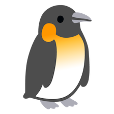

.. DedupliPy documentation master file, created by
   sphinx-quickstart on Sun Apr 18 11:28:40 2021.
   You can adapt this file completely to your liking, but it should at least
   contain the root `toctree` directive.

Welcome to DedupliPy's documentation!
=====================================

Deduplication is the task to combine different representations of the same real world entity. This package implements
deduplication using active learning. Active learning allows for rapid training without having to provide a large,
manually labelled dataset.

DedupliPy is an end-to-end solution with advantages over existing solutions:

- active learning; no large manually labelled dataset required
- during active learning, the user gets notified when the model converged and training may be finished
- works out of the box, advanced users can choose settings as desired (custom blocking rules, custom metrics,
  interaction features)

.. toctree::
   :maxdepth: 2
   :caption: Contents:

   installation
   Tutorial.ipynb
   api/modules

Indices and tables
==================

* :ref:`genindex`
* :ref:`modindex`
* :ref:`search`
